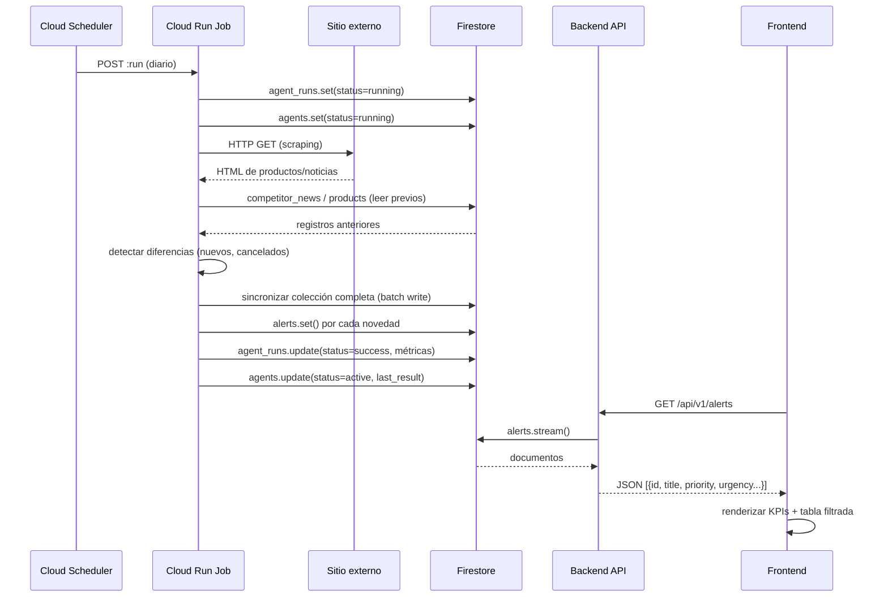
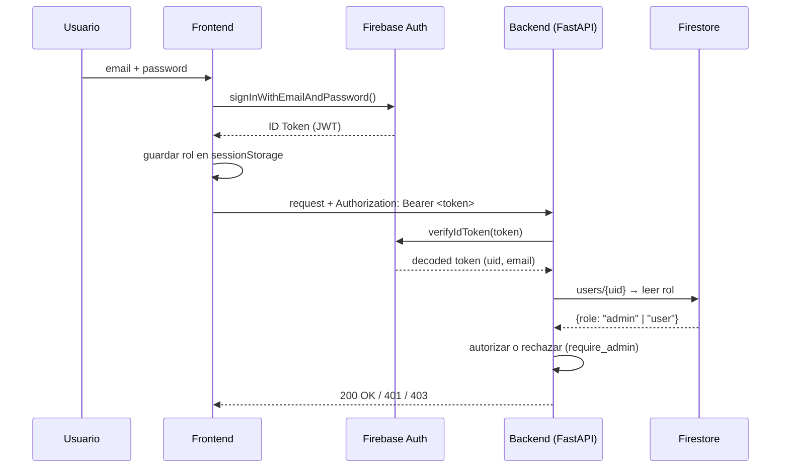
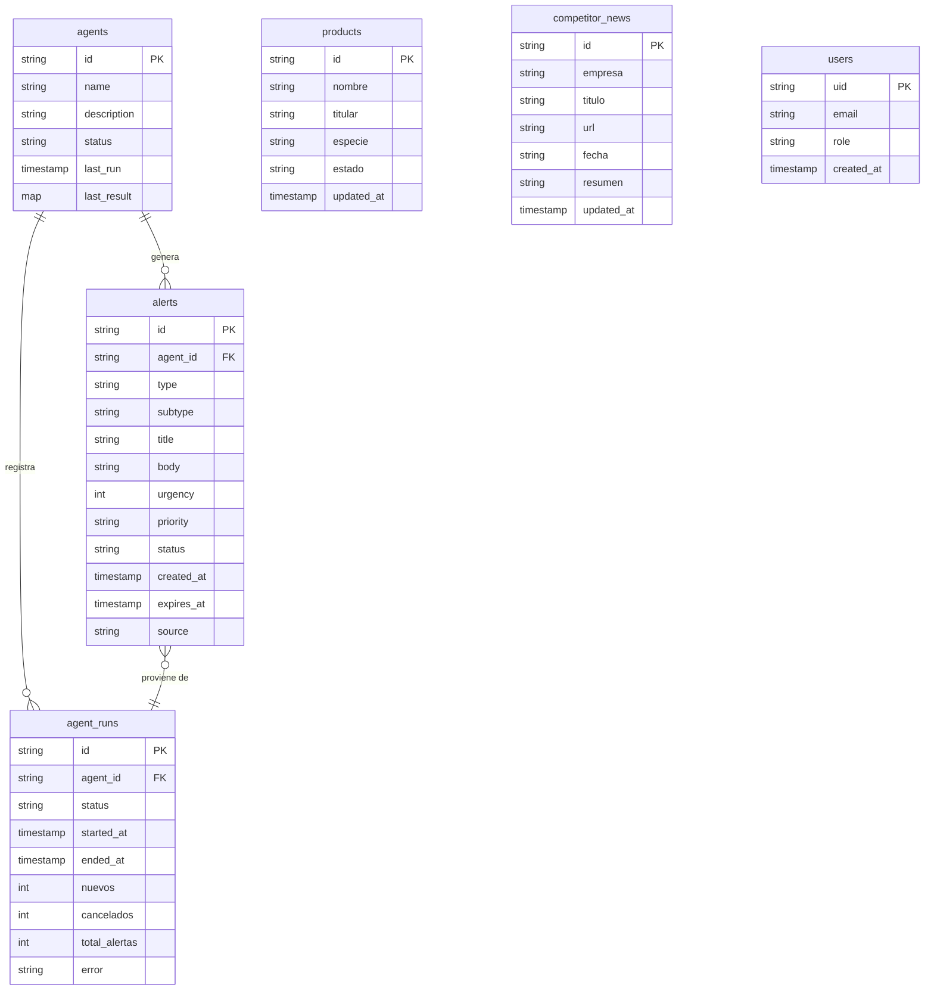

# ENCI-INTEL — Arquitectura del Sistema

## Diagrama general

```mermaid
graph TB
    subgraph USUARIO["👤 Usuario"]
        Browser["Navegador Web"]
    end

    subgraph FRONTEND["🖥️ Frontend — React 19 + TypeScript (Cloud Run)"]
        direction TB
        App["App.tsx\n(enrutador principal)"]

        subgraph LAYOUT["Layout"]
            Navbar["Navbar.tsx"]
            Sidebar["sidebar.tsx"]
            MainContent["mainContent.tsx"]
        end

        subgraph PAGES["Páginas"]
            Dashboard["Dashboard.tsx\n(KPIs + alertas)"]
            Alertas["Alertas.tsx\n(filtros + PDF export)"]
            Agentes["Agentes.tsx\n(config + historial)"]
            Productos["Productos.tsx"]
            Consultor["ConsultorVet.tsx\n(chat RAG)"]
            AdminDocs["AdminDocumentos.tsx"]
            AdminUsers["AdminUsuarios.tsx"]
        end

        subgraph SERVICES["Servicios"]
            ApiService["api.ts\n(axios + interceptors)"]
            AuthService["auth.ts"]
            FirebaseService["firebase.ts"]
            UsersService["users.ts"]
        end

        subgraph HOOKS["Hooks"]
            UseAuth["useAuth.ts"]
            UseStorage["useLocalStorage.ts"]
        end
    end

    subgraph GCP["☁️ Google Cloud Platform — proyecto: enci-intel"]

        subgraph CLOUDRUN_BACKEND["Cloud Run — Backend"]
            FastAPI["FastAPI app\n(main.py)"]

            subgraph ROUTERS["Routers /api/v1/"]
                R_Dashboard["/dashboard"]
                R_Alerts["/alerts"]
                R_Agents["/agents"]
                R_Products["/products"]
                R_Market["/market"]
                R_Chat["/chat"]
                R_Admin["/admin/documents"]
            end

            subgraph RAG["Motor RAG"]
                Engine["engine.py\n(Groq LLM)"]
                Loader["loader.py\n(GCS → chunks)"]
                Store["store.py\n(embeddings)"]
            end

            Auth["auth.py\n(Firebase verify)"]
            RateLimit["rate_limiter.py"]
        end

        subgraph AGENTES["Cloud Run Jobs — Agentes"]
            direction LR

            subgraph SAG["agente-sag"]
                SAGMain["main.py"]
                SAGScraper["scraper.py\n(SAG Chile)"]
                SAGDetector["detector.py\n(cambios)"]
            end

            subgraph COMP["agente-competidores"]
                COMPMain["main.py"]
                COMPScraper["scraper.py\n(Drag Pharma)"]
                COMPDetector["detector.py\n(noticias nuevas)"]
            end
        end

        subgraph SCHEDULER["Cloud Scheduler"]
            SchSAG["agente-sag-scheduler-trigger\n⏰ 08:00 UTC diario"]
            SchCOMP["agente-competidores-scheduler-trigger\n⏰ 20:00 Chile diario"]
        end

        subgraph FIRESTORE["Cloud Firestore"]
            ColAgents[("agents\n(estado de cada agente)")]
            ColRuns[("agent_runs\n(historial de ejecuciones)")]
            ColAlerts[("alerts\n(alertas generadas)")]
            ColProducts[("products\n(catálogo SAG)")]
            ColNews[("competitor_news\n(noticias Drag Pharma)")]
            ColUsers[("users\n(roles y permisos)")]
            ColDocs[("documents_metadata\n(archivos RAG)")]
        end

        subgraph GCS["Cloud Storage"]
            Bucket[("enci-intel-rag\n(documentos PDF/DOCX)")]
        end

        subgraph GCR["Container Registry"]
            ImgBackend["gcr.io/enci-intel/enci-intel-backend"]
            ImgFrontend["gcr.io/enci-intel/enci-intel-frontend"]
            ImgSAG["gcr.io/enci-intel/agente-sag"]
            ImgCOMP["gcr.io/enci-intel/agente-competidores"]
        end

        Firebase["Firebase Auth\n(autenticación)"]
        Groq["Groq API\n(LLM inference)"]
    end

    %% Flujo usuario → frontend
    Browser -->|"HTTPS"| App
    App --> LAYOUT
    App --> PAGES
    PAGES --> ApiService

    %% Frontend → Backend
    ApiService -->|"REST /api/v1/"| FastAPI
    ApiService -->|"Firebase SDK"| Firebase

    %% Backend → routers
    FastAPI --> Auth
    FastAPI --> RateLimit
    FastAPI --> R_Dashboard
    FastAPI --> R_Alerts
    FastAPI --> R_Agents
    FastAPI --> R_Products
    FastAPI --> R_Market
    FastAPI --> R_Chat
    FastAPI --> R_Admin

    %% Backend → Firestore
    R_Dashboard --> ColAlerts
    R_Dashboard --> ColAgents
    R_Alerts --> ColAlerts
    R_Agents --> ColAgents
    R_Agents --> ColRuns
    R_Products --> ColProducts
    R_Admin --> ColDocs

    %% RAG
    R_Chat --> Engine
    Engine --> Groq
    Engine --> Store
    Loader --> Bucket
    Loader --> Store

    %% Agentes → Firestore
    SAGScraper -->|"sag.gob.cl"| SAGDetector
    SAGDetector --> ColProducts
    SAGDetector --> ColAlerts
    SAGMain --> ColAgents
    SAGMain --> ColRuns

    COMPScraper -->|"dragpharma.cl"| COMPDetector
    COMPDetector --> ColNews
    COMPDetector --> ColAlerts
    COMPMain --> ColAgents
    COMPMain --> ColRuns

    %% Scheduler → Jobs
    SchSAG -->|"HTTP POST"| SAG
    SchCOMP -->|"HTTP POST"| COMP

    %% Images
    ImgBackend --> CLOUDRUN_BACKEND
    ImgFrontend --> FRONTEND
    ImgSAG --> SAG
    ImgCOMP --> COMP
```



---

## Diagrama de flujo de datos — Generación de alertas



---

## Diagrama de flujo — Autenticación



---

## Estructura de archivos

```
enci-intel-proyect/
├── Frontend/                          # React 19 + TypeScript + Vite
│   ├── src/
│   │   ├── App.tsx                    # Enrutador + estado global de vista
│   │   ├── main.tsx                   # Entry point
│   │   ├── types/index.ts             # Tipos globales (Vista, etc.)
│   │   ├── pages/
│   │   │   ├── Dashboard.tsx          # KPIs ejecutivos + centro de alertas
│   │   │   ├── Alertas.tsx            # Gestión de alertas + export PDF
│   │   │   ├── Agentes.tsx            # Config y monitoreo de agentes
│   │   │   ├── Productos.tsx          # Catálogo de productos SAG
│   │   │   ├── ConsultorVet.tsx       # Chat RAG con documentos
│   │   │   ├── AdminDocumentos.tsx    # Upload/delete documentos RAG
│   │   │   └── AdminUsuarios.tsx      # Gestión de usuarios
│   │   ├── components/
│   │   │   ├── auth/LoginScreen.tsx
│   │   │   ├── layout/Navbar.tsx
│   │   │   ├── layout/sidebar.tsx
│   │   │   ├── layout/mainContent.tsx
│   │   │   ├── modals/SettingsModal.tsx
│   │   │   ├── modals/ConstructionModal.tsx
│   │   │   └── ui/DarkModeSwitch.tsx
│   │   ├── services/
│   │   │   ├── api.ts                 # Cliente axios + interceptors auth
│   │   │   ├── firebase.ts            # Inicialización Firebase
│   │   │   ├── auth.ts                # Login/logout helpers
│   │   │   └── users.ts               # CRUD usuarios Firestore
│   │   ├── hooks/
│   │   │   ├── useAuth.ts             # Estado de sesión reactivo
│   │   │   └── useLocalStorage.ts
│   │   ├── i18n/
│   │   │   ├── translation.ts
│   │   │   └── locales/{es,en}.json
│   │   └── assets/style/
│   │       ├── index.css              # Estilos globales + dark mode
│   │       └── LoginScreen.css
│   ├── Dockerfile
│   ├── cloudbuild.yaml
│   └── .gitignore
│
├── Backend/
│   ├── app/                           # FastAPI — Cloud Run Service
│   │   ├── main.py                    # App + routers + CORS
│   │   ├── firebase_config.py         # Admin SDK init
│   │   ├── api/
│   │   │   ├── auth.py                # Middleware verificación Firebase
│   │   │   ├── rate_limiter.py        # Límite por usuario/hora
│   │   │   ├── dashboard.py           # GET /dashboard/summary
│   │   │   ├── alerts.py              # GET /alerts/
│   │   │   ├── agents.py              # GET+POST /agents/
│   │   │   ├── products.py            # GET /products/
│   │   │   ├── market.py              # GET /market/
│   │   │   ├── chat.py                # POST /chat/query
│   │   │   ├── admin_documents.py     # Upload/delete PDFs
│   │   │   └── firestore_service.py   # Helpers Firestore
│   │   └── rag/
│   │       ├── engine.py              # Groq LLM + retrieval
│   │       ├── loader.py              # GCS → chunks de texto
│   │       └── store.py               # Embeddings en memoria
│   │
│   ├── agents/                        # Cloud Run Jobs (independientes)
│   │   ├── agent-sag/
│   │   │   ├── main.py                # Orquestador
│   │   │   ├── scraper.py             # Descarga Excel SAG
│   │   │   ├── detector.py            # Detecta nuevos/cancelados
│   │   │   ├── firestore_session.py
│   │   │   ├── requirements.txt
│   │   │   └── Dockerfile
│   │   └── agent-competidores/
│   │       ├── main.py                # Orquestador
│   │       ├── scraper.py             # Raspa dragpharma.cl
│   │       ├── detector.py            # Detecta noticias nuevas
│   │       ├── firestore_session.py
│   │       ├── requirements.txt
│   │       └── Dockerfile
│   │
│   ├── Dockerfile                     # Backend principal
│   └── cloudbuild.yaml
│
├── .gitignore
└── ARCHITECTURE.md                    # Este archivo
```

---

## Colecciones Firestore



---

## Stack tecnológico

| Capa | Tecnología | Versión |
|---|---|---|
| Frontend | React | 19 |
| Frontend | TypeScript | 5 |
| Frontend | Vite | 6 |
| Backend | Python | 3.11 |
| Backend | FastAPI | — |
| Base de datos | Cloud Firestore | — |
| Autenticación | Firebase Auth | — |
| Almacenamiento | Cloud Storage | — |
| LLM | Groq API | — |
| Contenedores | Docker | — |
| CI/CD | Cloud Build | — |
| Hosting | Cloud Run | — |
| Scheduling | Cloud Scheduler | — |
| Registro imágenes | Container Registry (GCR) | — |
