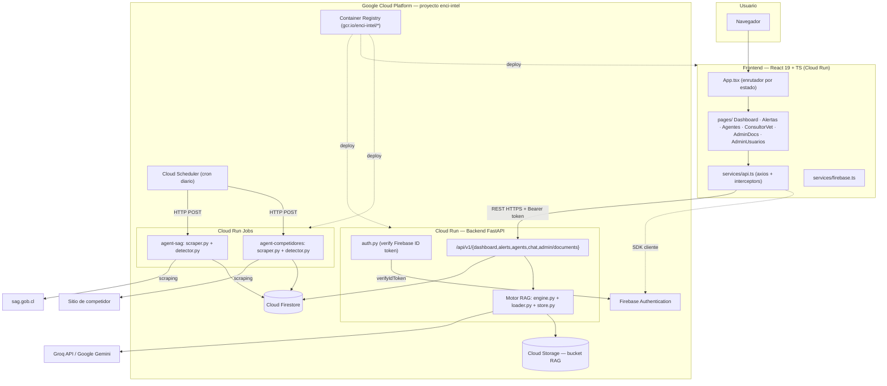
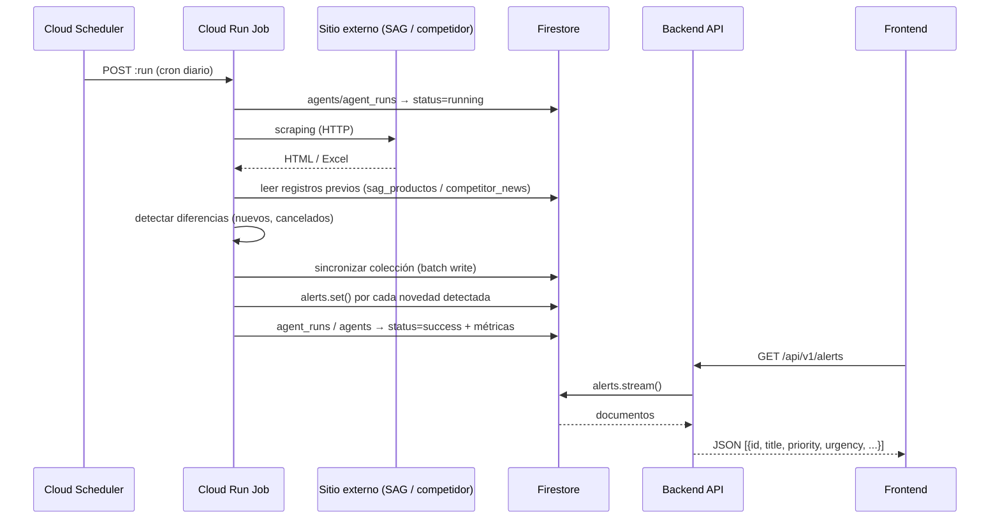
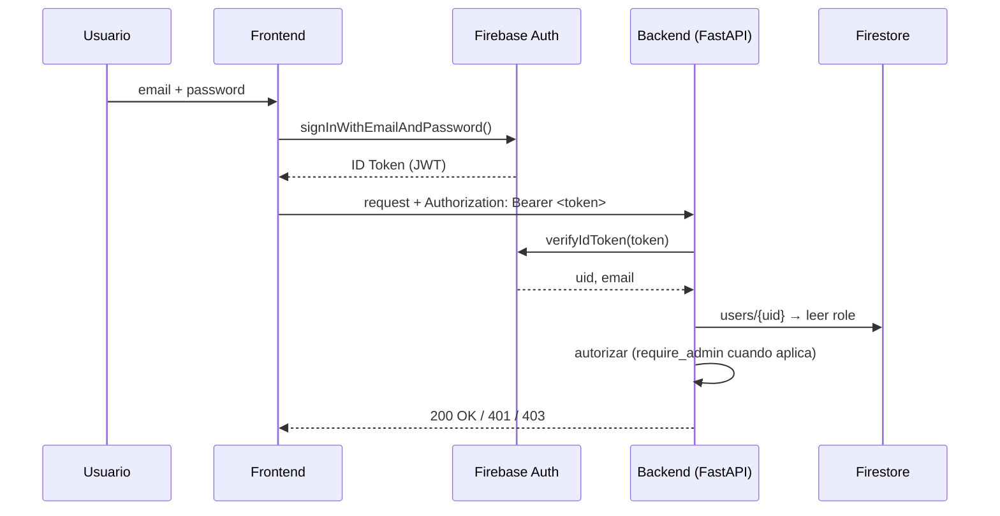
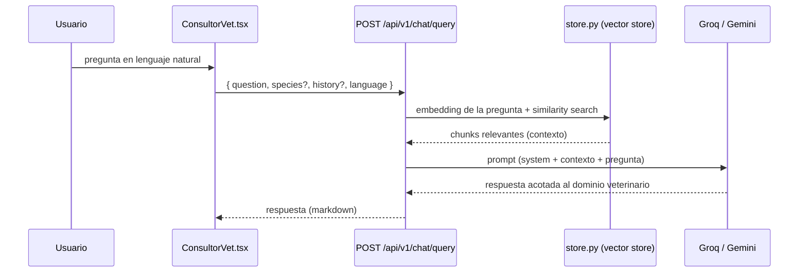

# ENCI-INTEL

Plataforma de inteligencia competitiva para el sector veterinario-farmacéutico en Chile. Monitorea automáticamente registros del **SAG** (Servicio Agrícola y Ganadero) y noticias de la competencia, genera alertas de negocio priorizadas, expone un dashboard ejecutivo y ofrece un **consultor veterinario con IA (RAG)** que responde preguntas técnicas a partir de documentos propios.

> Diagramas adicionales (modelo Firestore, secuencias completas) en [ARCHITECTURE.md](ARCHITECTURE.md).

## Contenido

- [Arquitectura](#arquitectura)
- [Stack tecnológico](#stack-tecnológico)
- [Estructura del repositorio](#estructura-del-repositorio)
- [Flujos principales](#flujos-principales)
- [API del backend](#api-del-backend)
- [Modelo de datos (Firestore)](#modelo-de-datos-firestore)
- [Roles y permisos](#roles-y-permisos)
- [Requisitos previos](#requisitos-previos)
- [Configuración](#configuración)
- [Desarrollo local](#desarrollo-local)
- [Tests](#tests)
- [CI/CD y despliegue](#cicd-y-despliegue)
- [Troubleshooting](#troubleshooting)
- [Contribuir](#contribuir)

## Arquitectura

Monorepo con dos aplicaciones desplegadas en **Cloud Run**, dos **Cloud Run Jobs** de scraping disparados por **Cloud Scheduler**, y **Firestore**/**Cloud Storage** como capa de datos.



## Stack tecnológico

| Capa | Tecnología | Notas |
|---|---|---|
| Frontend | React 19.2, TypeScript ~6.0, Vite 8 | React Compiler habilitado vía Babel plugin |
| Frontend | axios ^1.17 | Cliente HTTP con interceptors de auth |
| Frontend | i18next / react-i18next | Soporte ES/EN |
| Frontend | react-markdown | Render de respuestas del chat IA |
| Frontend | firebase ^12.14 | Auth SDK cliente + Firestore |
| Backend | Python 3.11+ / FastAPI / Uvicorn | API REST, `lifespan` inicializa Firebase Admin y el motor RAG |
| Backend | firebase-admin 6.9.0 | Verificación de ID tokens, acceso admin a Firestore |
| Backend | google-cloud-firestore / google-cloud-storage | Persistencia y almacenamiento de documentos |
| RAG | groq / google-genai | Proveedor de LLM intercambiable (Groq tiene prioridad si su API key está definida) |
| RAG | fastembed | Embeddings locales (usados con proveedor Groq) |
| RAG | pypdf | Extracción de texto de PDFs para indexar |
| Datos | Cloud Firestore | Base de datos documental principal |
| Almacenamiento | Cloud Storage | Bucket `enci-intel-rag`: PDFs + vector store persistido |
| Autenticación | Firebase Authentication | Login por email/password, rol embebido en Firestore (`users/{uid}`) |
| Contenedores | Docker (multi-stage) | Frontend: `node:20-alpine` → `nginx:alpine`. Backend: `python:3.12-slim` |
| CI/CD | GitHub Actions + Google Cloud Build | Lint, tests, escaneo de seguridad, build, deploy |
| Hosting | Cloud Run + Cloud Run Jobs | Servicios y jobs por componente |
| Scheduling | Cloud Scheduler | Dispara los Cloud Run Jobs diariamente |
| Registro de imágenes | Container Registry (GCR) | `gcr.io/enci-intel/{enci-intel-backend,enci-intel-frontend,agente-sag,agente-competidores}` |

## Estructura del repositorio

```
Enci-intel-proyect/
├── Frontend/                          # React 19 + TypeScript + Vite
│   └── src/
│       ├── App.tsx                    # Enrutador por estado (tipo Vista), sin react-router
│       ├── main.tsx
│       ├── types/index.ts             # Vista, Role, Language
│       ├── pages/
│       │   ├── Dashboard.tsx          # KPIs ejecutivos + centro de alertas
│       │   ├── Alertas.tsx            # Filtros + export PDF
│       │   ├── Agentes.tsx            # Config/monitoreo de agentes (admin)
│       │   ├── ConsultorVet.tsx       # Chat RAG
│       │   ├── AdminDocumentos.tsx    # Upload/delete de PDFs (admin)
│       │   └── AdminUsuarios.tsx      # Gestión de usuarios (admin)
│       ├── components/{auth,layout,modals,ui}/
│       ├── services/
│       │   ├── api.ts                 # axios + interceptors (Bearer token)
│       │   ├── auth.ts                # login/logout
│       │   ├── firebase.ts            # init Firebase (config Web pública)
│       │   └── users.ts               # CRUD usuarios en Firestore
│       ├── hooks/{useAuth,useLocalStorage}.ts
│       └── i18n/{translation.ts,locales/{es,en}.json}
│
├── Backend/
│   ├── app/                           # Cloud Run Service (API)
│   │   ├── main.py                    # App FastAPI, CORS, routers, lifespan
│   │   ├── firebase_config.py         # Init Admin SDK / cliente Firestore
│   │   ├── api/
│   │   │   ├── auth.py                # Verificación de token, require_admin
│   │   │   ├── rate_limiter.py        # Límite de requests por usuario
│   │   │   ├── cache.py               # Cache TTL sobre lecturas a Firestore/GCS
│   │   │   ├── firestore_service.py   # Helpers de acceso a Firestore
│   │   │   ├── dashboard.py           # GET /summary
│   │   │   ├── alerts.py              # GET /
│   │   │   ├── agents.py              # GET / POST / PATCH
│   │   │   ├── chat.py                # POST /query, /stream · GET /docs-count
│   │   │   └── admin_documents.py     # GET / POST /upload · DELETE /{filename}
│   │   ├── rag/
│   │   │   ├── engine.py              # Orquestación: retrieval + prompt + LLM
│   │   │   ├── loader.py              # Carga PDFs (GCS o disco) → chunks
│   │   │   └── store.py               # Vector store en memoria / vector_store.pkl
│   │   └── docs/                      # Base documental (PDFs) para el RAG
│   ├── agents/                        # Cloud Run Jobs independientes
│   │   ├── agent-sag/
│   │   │   ├── main.py                # Orquestador (sync + alertas)
│   │   │   ├── scraper.py             # Descarga listado SAG
│   │   │   ├── detector.py            # Detecta altas/cancelaciones
│   │   │   └── firestore_session.py
│   │   └── agent-competidores/
│   │       ├── main.py                # Acepta --dry-run --populate-only --force-alerts
│   │       ├── scraper.py             # Scraping de noticias
│   │       ├── detector.py            # Detecta noticias nuevas
│   │       └── firestore_session.py
│   ├── tests/                         # pytest (mocks de Firebase/Firestore/LLM)
│   ├── Dockerfile
│   ├── requirements.txt
│   └── .env.example
│
├── .github/workflows/{backend.yml,frontend.yml}
└── ARCHITECTURE.md
```

## Flujos principales

### Generación de alertas (agentes → dashboard)



### Autenticación



### Consulta al Consultor Vet (RAG)



## API del backend

Todos los endpoints cuelgan de `/api/v1`. La autenticación es un Bearer token de Firebase; `CHAT_AUTH_REQUIRED` y `ADMIN_AUTH_REQUIRED` controlan si se exige en cada grupo.

| Método | Ruta | Descripción |
|---|---|---|
| GET | `/dashboard/summary` | KPIs agregados para el dashboard |
| GET | `/alerts/` | Lista de alertas (filtrable) |
| GET | `/agents/` | Estado de todos los agentes |
| GET | `/agents/{agent_id}` | Detalle de un agente |
| GET | `/agents/{agent_id}/runs` | Historial de ejecuciones |
| POST | `/agents/{agent_id}/run` | Dispara una ejecución manual |
| PATCH | `/agents/{agent_id}/schedule` | Actualiza el cron del agente |
| PATCH | `/agents/{agent_id}/enabled` | Habilita/deshabilita el agente |
| POST | `/chat/query` | Pregunta al consultor RAG (respuesta completa) |
| POST | `/chat/stream` | Igual que `/query`, en streaming |
| GET | `/chat/docs-count` | Cantidad de documentos indexados |
| GET | `/admin/documents/` | Lista documentos cargados para el RAG (admin) |
| POST | `/admin/documents/upload` | Sube un PDF al bucket + reindexa (admin) |
| DELETE | `/admin/documents/{filename}` | Elimina un documento (admin) |
| GET | `/health` | Healthcheck |

**Ejemplos**

```bash
# Consultar al consultor RAG
curl -X POST http://localhost:8000/api/v1/chat/query \
  -H "Content-Type: application/json" \
  -H "Authorization: Bearer <ID_TOKEN_FIREBASE>" \
  -d '{"question": "¿Cuál es la dosis recomendada de X para bovinos?", "species": "bovino", "language": "es"}'

# Respuesta
{
  "success": true,
  "data": { "answer": "...", "sources": [ { "document": "manual.pdf", "page": 12 } ] }
}

# Listar alertas activas
curl http://localhost:8000/api/v1/alerts/ \
  -H "Authorization: Bearer <ID_TOKEN_FIREBASE>"

# Disparar manualmente el agente SAG (requiere rol administrador)
curl -X POST http://localhost:8000/api/v1/agents/agent-sag/run \
  -H "Authorization: Bearer <ID_TOKEN_FIREBASE>"
```

## Modelo de datos (Firestore)

| Colección | Contenido |
|---|---|
| `agents` | Estado actual de cada agente (`status`, `last_run`, `last_result`) |
| `agent_runs` | Historial de ejecuciones (métricas, errores, timestamps) |
| `alerts` | Alertas generadas (`type`, `priority`, `urgency`, `status`, `source`) |
| `sag_productos` | Catálogo de productos SAG y su estado (`vigente`/`cancelado`) |
| `competitor_news` | Noticias detectadas del competidor monitoreado |
| `users` | Usuarios y su `role` (`administrador`, `gerencia`, `comercial`, `pendiente`) |

Detalle de campos por colección (ER diagram) en [ARCHITECTURE.md](ARCHITECTURE.md#colecciones-firestore).

## Roles y permisos

El rol se guarda en Firestore (`users/{uid}.role`) y se valida tanto en frontend (qué se muestra) como en backend (`require_admin`, `ADMIN_AUTH_REQUIRED`):

| Rol | Dashboard / Alertas / Consultor IA | Panel Agentes | Admin Usuarios / Documentos |
|---|---|---|---|
| `administrador` | ✅ | ✅ | ✅ |
| `gerencia` | ✅ | ❌ | ❌ |
| `comercial` | ✅ | ❌ | ❌ |
| `pendiente` | ❌ (login bloqueado hasta que un admin le asigne rol) | ❌ | ❌ |

Un usuario nuevo entra como `pendiente` por defecto; un `administrador` debe cambiarle el rol desde **Admin Usuarios** para que pueda acceder.

## Requisitos previos

- Node.js 20+ y npm
- Python 3.11+
- Proyecto de Firebase/GCP con **Firestore** habilitado y un archivo de credenciales de servicio
- API key de [Groq](https://groq.com/) y/o [Google Gemini](https://ai.google.dev/) para el motor RAG

## Configuración

### Backend

```bash
cd Backend
cp .env.example .env
```

Variables (ver [Backend/.env.example](Backend/.env.example); **nunca** commitear `.env` ni archivos de credenciales):

| Variable | Descripción |
|---|---|
| `GEMINI_API_KEY` | API key de Google Gemini (proveedor LLM) |
| `GROQ_API_KEY` | API key de Groq (proveedor LLM; prioridad sobre Gemini si está definida) |
| `CHAT_AUTH_REQUIRED` | Exige autenticación en `/chat/*` |
| `ADMIN_AUTH_REQUIRED` | Exige autenticación/rol admin en `/admin/*` y `/agents/*` de escritura |
| `GOOGLE_APPLICATION_CREDENTIALS` | Ruta local al archivo de credenciales de servicio de GCP |
| `GCS_BUCKET_NAME` | Bucket de Cloud Storage para vector store + documentos (opcional; sin definir usa disco local) |
| `GCP_PROJECT_ID` | ID del proyecto GCP (usado por los agentes, default `enci-intel`) |

Además se necesita un archivo de credenciales de servicio de Google Cloud (por ejemplo `serviceAccountKey.json`) en la ruta indicada por `GOOGLE_APPLICATION_CREDENTIALS`. Este archivo está en `.gitignore`/`.dockerignore` y **no debe subirse jamás al repositorio**.

### Frontend

Crear `Frontend/.env` con:

| Variable | Descripción |
|---|---|
| `VITE_API_BASE_URL` | URL base del backend (ej. `http://localhost:8000/api/v1` en desarrollo) |

La configuración pública del SDK Web de Firebase vive en `Frontend/src/services/firebase.ts` (las claves Web de Firebase no son secretas por diseño; la seguridad depende de las reglas de Firestore/Auth).

## Desarrollo local

No hay `docker-compose`; cada servicio se levanta por separado.

**Backend**

```bash
cd Backend
python -m venv .venv
.venv\Scripts\activate          # Windows
pip install -r requirements.txt
uvicorn app.main:app --reload --port 8000
```

El backend acepta por defecto CORS desde `localhost:5173` / `5174` (puertos típicos de Vite).

**Frontend**

```bash
cd Frontend
npm install
npm run dev
```

**Agentes (ejecución manual)**

```bash
cd Backend
python agents/agent-sag/main.py
python agents/agent-competidores/main.py --dry-run   # no escribe en Firestore
```

En producción ambos corren como Cloud Run Jobs disparados por Cloud Scheduler.

## Tests

**Backend** (pytest, cobertura mínima 40% en CI):

```bash
cd Backend
pytest tests/ -v --cov=app --cov-report=xml
```

`tests/conftest.py` mockea `firebase_admin`, `google.cloud.firestore`, `fastembed`, `groq` y `google.genai`, por lo que los tests corren sin credenciales reales.

**Frontend** (sin suite de tests unitarios; se valida vía lint + type-check + build):

```bash
cd Frontend
npm run lint
npm run build
```

## CI/CD y despliegue

`.github/workflows/backend.yml` y `.github/workflows/frontend.yml`, disparados en push/PR a `main`, `develop` y `test/agentes`:

1. **lint-test**: `ruff check` + `safety check` (backend) / `eslint` (frontend), luego tests con cobertura.
2. **build-push**: build de imagen Docker, push a `gcr.io/<project>/...`.
3. **scan-image**: escaneo de vulnerabilidades con **Trivy** (falla en severidad CRITICAL).
4. **deploy-test**: deploy a Cloud Run al hacer merge a `develop`.
5. **deploy-prod**: deploy a Cloud Run al hacer merge a `main`.

Los pipelines usan secrets de GitHub (credenciales de servicio de GCP y API keys) inyectados en tiempo de ejecución — nunca están en el código. También existen `cloudbuild.yaml` / `cloudbuild-test.yaml` como alternativa vía Google Cloud Build.

## Troubleshooting

| Síntoma | Causa probable | Solución |
|---|---|---|
| `403`/`401` al llamar cualquier endpoint del backend en local | `ADMIN_AUTH_REQUIRED`/`CHAT_AUTH_REQUIRED` en `true` sin enviar token | Envía `Authorization: Bearer <token>`, o ponlas en `false` solo para desarrollo local |
| Error de CORS en el navegador al llamar al backend | El puerto del frontend no está en `allow_origins` de `app/main.py` | Corre Vite en `5173`/`5174`, o agrega tu origen a la lista de CORS |
| `google.auth.exceptions.DefaultCredentialsError` al levantar el backend | Falta `GOOGLE_APPLICATION_CREDENTIALS` o el archivo no existe en esa ruta | Genera una clave de servicio en GCP (IAM & Admin → Service Accounts) y apunta la variable al archivo `.json` local |
| El consultor IA responde "no tengo información" siempre | No hay documentos indexados (`GET /chat/docs-count` = 0) | Sube PDFs desde **Admin Documentos** o revisa que `GCS_BUCKET_NAME`/carpeta local tenga archivos |
| Cambiaste de proveedor LLM (Groq ↔ Gemini) y las respuestas no cambian | El vector store quedó cacheado con los embeddings del proveedor anterior | Borra `Backend/data/vector_store.pkl` (o el objeto equivalente en el bucket GCS) y reinicia el backend |
| `429 Límite diario de consultas alcanzado` en el chat | Rate limiter en memoria (`rate_limiter.py`): 50 consultas/día por `uid`, se resetea al reiniciar el proceso | Espera al reset diario, reinicia el backend en local, o ajusta `DAILY_LIMIT` en `app/api/rate_limiter.py` |
| Los agentes no generan alertas nuevas | Ejecutados con `--dry-run`, o no hay diferencias reales respecto a la última sincronización | Corre sin `--dry-run`, o usa `--force-alerts` en `agent-competidores` para forzar |

## Contribuir

Flujo de trabajo basado en ramas y Pull Requests:

- `main`: código en producción, siempre estable.
- `develop`: rama principal de integración de nuevas funcionalidades.
- `feature/*`: ramas temporales para nuevas funcionalidades, creadas desde `develop`.
- `hotfix/*`: correcciones urgentes directamente sobre `main`.

**Convención de commits:** `feat:`, `fix:`, `docs:`, `refactor:`, `chore:`.

```bash
git checkout develop
git pull origin develop
git checkout -b feature/nombre-descriptivo
# ...commits pequeños y claros...
git push origin feature/nombre-descriptivo
# abrir Pull Request hacia develop
```
